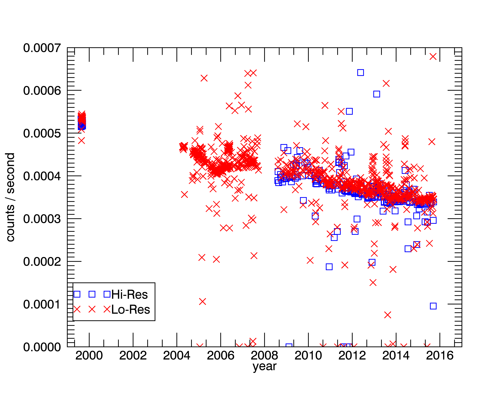

(sec:calib)=
# UVIS Calibration

```
Greg Holsclaw
```

## Introduction

This chapter provides an overview of the UVIS EUV and FUV channel calibration and
demonstrates how to produce calibrated data products from a PDS dataset.

## Instrument overview

The optical design of UVIS is described by {cite:t}`McClintock1993-fu` and the science
investigation by {cite:t}`Esposito2004-kr`. 
A description of the instrument is also provided in the file [CATALOG/UVISINST.CAT](https://pds-rings.seti.org/holdings/volumes/COUVIS_0xxx/COUVIS_0003/CATALOG/UVISINST.CAT) found within any UVIS data volume in the PDS. 
A brief overview of the instrument relevant to the current discussion of calibration will be presented here.
The Cassini Ultraviolet Imaging Spectrograph (UVIS) contains four separate remote sensing
subsystems integrated in a single mechanical assembly.
These subsystems are referred to as the Far Ultraviolet Spectrograph (FUV), the Extreme Ultraviolet Spectrograph (EUV), the High Speed Photometer (HSP) and the Hydrogen-Deuterium Absorption Cell (HDAC).
{numref}`tab:uvis-design` contains the design parameters for each subsystem.
Because the interpretations of data from the EUV and FUV channels require a well-understood calibration, the rest of this chapter will be limited to these two subsystems only.

```{table} Summary of the UltraViolet Imaging Spectrograph design specifications
:name: tab:uvis-design

||FUV  | EUV | HSP | HDAC|
|--- | --- | --- | --- | --- |
|**TELESCOPE**|||||
| Focal length (mm)| 100 | 100 | 200 | 150 |
| Entrance pupil size (mm) | 20 x 20 | 20 x 20 | 133 x 38 | 25 mm Dia|
| Reflecting surface (Material) | Al + MgF2 | Boron Carbide | Al + MgF2 | MgF2 |
| **TOROIDAL GRATINGS**|||||
| Grating radii (mm) |300, 296.1 | 300, 296.8 |||
| Grating surface | Al + MgF2 | Boron Carbide |||
| Grooves/mm | 1066 | 1371 |||
| Input angle a (degrees) | 9.22 | 8.03 |||
| Out angles b (degrees) | ±2.45 | -3.63, +1.27 |||
| Dispersion (Å/mm) | 31.18 |24.20 |||
| Dispersion (Å/pixel) | 0.7794 | 0.6049 |||
| **3-POSITION SLITS**|||||
| Slit widths (microns) | 75, 150, 800 | 100, 200, 800 |||
| Dl (Å) atmosphere | 2.75, 4.8, 24.9 | 2.75, 4.8, 19.4 |||
| Field of View (mrad) |(0.75, 1.5, 8)x60 | (1, 2, 8)x59 | 6.0 (az) x 6.4 (el) | 58 Dia (FWHM) |
|**DETECTORS**|||||
|Photocathode | CsI | KBr | CsI | KBr |
|Detector window | MgF2 |none | MgF2 | MgF2 |
|Detector size (mm) | 25.6 x 6.4 | 25.6 x 6.4 | 8 mm Dia |13 mm Dia |
| Pixel format (l x q) | 1024 x 64 | 1024 x 64 |||
| Pixel size (m) | 25 x 100 | 25 x 100 |||
```

## Terminology

As presented in {numref}`sec:pds-data-structure`, the NASA Planetary Data System (PDS) favors the
terminology of `line` and `band` to describe the perpendicular dimensions of a two-dimensional
array detector. 
However, the terms `column` and `row` are more often encountered. 
In this chapter, a `column` will refer to all the detector elements at a given wavelength center, each of which exists at a unique spatial location.
Likewise, a `row` refers to all detector elements at a given spatial location, each of which exists at a unique wavelength center. 
Thus, `columns` are equivalent to `bands` while `rows` are equivalent to `lines`.

## Radiometric equation

The number of counts recorded for a pixel at column $i$ and row $j$ can be expressed as:

```{math}
C_{ij} = L_{ij}\cdot\frac{A_t\cdot A_s}{f^2}\cdot\frac{1}{K}\cdot FF_{ij}\cdot T_i\cdot QE_i\cdot \delta\lambda_i\cdot t+B_{ij}+S_{ij}
```

where 
- $L_{ij}$ is the radiance at that pixel, 
- $A_t$ is the area of the telescope entrance pupil (20 × 20 mm),
- $A_s$ is the area of the entrance slit (three slits per channel, see Table 1), 
- $f$ is telescope focal length (100 mm), 
- $K$ is the number of rows illuminated by the image of a filled slit (60 for FUV, 59 for EUV), 
- $FF_{ij}$ is the pixel-to-pixel sensitivity variation (also known as the “flat field”, see {numref}`sec:calib-flatfield`),
- $T_i$ is the system transmission (i.e. mirror reflectance, grating efficiency, and window transmission), 
- $QE$ is the quantum efficiency (detected counts per incident photon), 
- $\delta\lambda_i$ is the spectral width of a pixel (average of 0.07794 nm for FUV, 0.0609 nm for EUV), 
- $t$ is the
integration time (seconds), 
- $B_{ij}$ is any background signal present, and 
- $S_{ij}$ is scattered light.

The sensitivity of the instrument was measured during laboratory calibration prior to
launch. 
Using this instrument sensitivity, the recorded counts can be converted to geophysical
units:

```{math}
:label: eq:convert-geo
L_{ij}=(C_{ij}-B_{ij}-S_{ij})\cdot M_{ij}
```
where $M_{ij}$ is the inverse of the sensitivity and has units of kilorayleigh/(count x angstrom):

```{math}
M_{ij} = \frac{f^2}{A_t\cdot A_s}\cdot K\cdot\frac{1}{FF_{ij}\cdot T_i\cdot QE_i\cdot \delta\lambda_i\cdot t}
```

Note that the calibration matrix provided at the PDS includes the integration time, and so the
user does not need to derive count rate (as would be more typical) before applying the
calibration. Calibrated values, resulting from the multiplication of the data and the calibration
matrix, will carry units of kilorayleigh per angstrom. 

The derived radiance value in Eq. {eq}`eq:convert-geo` has significance only if the entrance slit width and pixel height (spatial dimension) is filled by the target. 
The dark current of the UVIS CODACON detectors is expected to be negligible.
A persistent source of background _B_ is thought to be caused by the radioisotope
thermoelectric generators (RTGs) that power the Cassini spacecraft. 
{numref}`fig:fuv-background` shows a measure of the FUV detector background over time, calculated by finding the mean value of all pixels in the detector area defined by columns 950 to 1015 and rows 2 to 60 extracted from routine observations of interplanetary hydrogen. 
Values derived from observations using the high-resolution and low-resolution entrance slit are shown separately. 
The background from the low-resolution data is slightly, but systematically larger than the background determined from the high-resolution data. 
This difference indicates a small contribution of scattered Lyman-alpha, as the low-resolution entrance slit is twice the width of the high-resolution slit. 
After filtering out extreme values (those outside +/-30% of the median), an exponential function was fit to the low-resolution data and is shown as the solid line in the {numref}`fig:fuv-background`.

Values above the primary trend indicate contamination by stars or planetary bodies that have entered the field of view, or due to ring-crossing events that have been found to significantly increase the UVIS detector background. 
Values below the primary trend indicate partial data loss during downlink. 
The decrease in UVIS detector background is qualitatively consistent with the expected decay of
$^{238}Pu$ within the RTGs.

Another source of background is the relatively bright signal due to solar emission at the
Lyman-α wavelength (121.6 nm) scattered by interplanetary hydrogen (IPH). 
Due to scattering within the spectrograph (see {numref}`sec:spec-scattered`), this IPH signal is detectable across much of the FUV detector as well as the long-wavelength end of the EUV detector. 
It is recommended that background estimates be determined for each observation independently.


:::{figure-md} fig:fuv-background


Background count rate in the FUV detector as a function of time.
:::
(sec:spec-scattered)=
## Spectrometer scattered light

The scattering properties of a spectrometer will redistribute signal at any wavelength to
other positions across the detector in a predictable manner. 
Ideally, a monochromatic point source would be used to characterize this point-spread function (PSF). 
While there is no such source available in-flight, sunlight scattered by interplanetary hydrogen can provide an essentially monochromatic, though spatially extended, source.
In 1999, a campaign consisting of many long-exposure observations was conducted to measure the instrument response to illumination by the IPH.
<mark>Figure 3.2</mark> shows an average FUV spectrum from these observations using the low-resolution entrance slit. 
An analytic model defined by a Gaussian function (to characterize the central, high signal portion of the PSF) plus a Lorentzian function (to characterize the broad, low-signal wings) is given in Equation {eq}`eq:convert-geo`.
Because the signal originates from an extended source, the function must be convolved with a
rectangular function representing the geometric image of the low-resolution entrance aperture.
The model given in Eqn {eq}`eq:convert-geo` was fit to the data, and is shown as a dashed line in <mark>Figure 3.2</mark>. 
The model coefficients from this fit are listed in {numref}`tab:iph-coeffs`.


```
<mark>Figure 3.2</mark> – Average FUV spectrum of interplanetary hydrogen along with a fit to an analytic function.
```

```{math}
:label: eq-iph-model
f = \left[a_0 + a_1\cdot \exp{\left(\frac{-0.5(x-a_2)^2}{a^2_3}\right)}+\frac{a_4}{1+\frac{1}{a_5}(x-a_2)^2}\right]\otimes rect\left(\frac{x-a_2}{w}\right)
```

### Coefficients

These are the coefficients of the model given in {eq}`eq-iph-model` after fitting to the data shown in <mark>Figure 3.2</mark>:

```{table} Model coefficients
:name: tab:iph-coeffs

| Coeff | Value |
| ----  | ----  |
| $a_0$ | 0     |
| $a_1$ | 0.318 |
| $a_2$ | 121.569|
| $a_3$ | 0.149 |
| $a_4$ | 0.00373|
| $a_5$ | 1.507 |
```
(sec:calib-flatfield)=
## In-flight updates to the calibration

The calibration of the instrument has been monitored during flight by acquiring periodic
observations of the star α Virginis (Spica). 
Initial analysis of measurements obtained after launch indicated that the stellar spectrum was consistent with results from previous investigators.
However, later observations revealed that the sensitivity of the long-wavelength end of the FUV
detector was actually _increasing_ with time. 
The nature of this change is still not completely understood. 
In any case, a time-varying sensitivity was formulated and has been applied to all data obtained since launch.

Other changes to the instrument sensitivity have been noted over time. 
Around June 6, 2002 a long observation of the star Spica was executed to characterize the scattering properties of the Imaging Science Subsystem (ISS) cameras onboard Cassini. 
Although the UVIS instrument did not acquire any data at this time, the relatively high photon flux resulted in a decrease in the sensitivity in the central few rows (~30-33) of both the EUV and FUV detector.
This event is referred to as the “starburn” and is discussed in more detail by Steffl (2005). 
The loss in sensitivity is proportional to the photon flux at any wavelength, and so the effect appears as an inverted spectrum of Spica.

The flat-field response (pixel-to-pixel sensitivity variation) of the instrument detectors
was not characterized prior to launch. 
A series of observations of Spica were obtained which slewed the stellar image across the spectrograph entrance slit in a pattern such that a relative pixel-to-pixel response could be derived. 
This procedure is documented in Appendix A of Steffl (2005). 
A flat-field corrector matrix was derived for both the time before and the time after the
starburn event. 
The post-burn matrix attempts to correct for the loss in sensitivity in rows 30- 33
due to the starburn. 
The FUV flat-field correction matrix can be found in any UVIS PDS volume under /SOFTWARE/CALIB/VERSION_n/ where n is an integer indicating the calibration version number. 
As of March 2014, version 3 is the most current.

It has been noted that the sensitivity in the starburn region continues to decrease over
time, likely due to the repeated use of bright stars like Spica as a source for occultation
measurements. 
The sensitivity loss appears to be proportional to the integrated photon flux over
time. 
There are other examples of regional sensitivity loss from this effect, especially in the
FUV detector. 
The FUV occultation slit was often left in position following routine
measurements of IPH. 
This allowed a significant flux of Lyman- α photons to fall on the detector
in the clear regions above and below the occultation lens holder. 
The effect is a loss in sensitivity in a region where the image of the occultation slit would appear at a wavelength of 121.6 nm within rows 2-12, 51-61.

The planet Saturn, its moons, and the rings enter the field-of-view while the FUV occultation slit is in position, though the instrument may not be acquiring data.
Because these objects scatter incident sunlight, a significant flux of photons is incident on the
detector at long wavelengths (where the solar irradiance is large). 
The effect, again, is the decrease in sensitivity in the region above and below the occultation slit lens holder (rows 2-12, 51 - 61) at the long-wavelength end of the FUV detector.

In order to mitigate these regional losses in sensitivity, a procedure was developed to
derive correction values. 
This was accomplished by first identifying detector rows that are within
the region obscured by the FUV occultation lens holder (rows 18-23, 41-46). 
Next, the relative response of each column to the average value from these “reference” rows is calculated for a stellar calibration where a star is slewed along the slit, creating an effective extended object. 
The inverse of these values, referred to as a “flat-field modifier”, is derived for every successful stellar calibration. 
A correction matrix is linearly interpolated with time for any observation that
occurs between calibrations.

All corrections and adjustments to the UVIS sensitivity that have been discussed here are
included with the UVIS calibration matrix delivered to the PDS.

## Anomalous pixels

A population of anomalous pixels has been identified on the FUV detector. 
These pixels are characterized by a relatively low response and they also may exhibit a nonlinear response.
These pixels are often referred to as “evil” and they comprise ~15% of all detector elements.
Although these anomalous pixels are distributed across the entire FUV detector, they often
appear in groups along individual columns. 
Because of the poorly characterized response of these evil pixels, the UVIS team has decided to eliminate them from analysis. 
This is implemented by assigning an invalid sensitivity to the calibration matrix for these elements. 
Evil pixels are flagged as invalid by assigning them the CORE_NULL value indicated in any
calibration label file, and this value is - 1 for the current (version 3) calibration.
The approach described above creates an irregular grid of data. There are several methods
for dealing with such datasets, and one suggested approach is to linearly interpolate across any
flagged pixel. 
An IDL routine is provided by the UVIS team to perform this interpolation
(`interpolate_nans2.pro`), and its use will be described in an example later in this chapter.
The presence of such flagged pixels creates a unique problem for binned data. 
Since binning occurs within the instrument’s flight software, there is no way to recover the value of a “good” pixel that has been combined with an “evil” pixel. 
The flagging of evil pixels in the calibration matrix forces any binned element to also retain this value. 
The effect of this approach is that for larger bin sizes, a larger fraction of invalid (flagged) pixels will be present in the data.
For moderate levels of binning, the interpolation approach may still be a useful option.
However, for some datasets the binning is so large that the calibration matrix contains invalid
(flagged) pixels exclusively. 
Such datasets may yet yield useful information, but special consideration is required on a case-by-case basis. 
Any user interested in analyzing such a dataset is encouraged to contact a UVIS team member.
One approach to estimate the response of anomalous pixels in heavily binned data is provided in Chapter 4.

## Example calibration of a PDS dataset

The UVIS Data Product Software Interface Specification (SIS) document provides a
detailed description of the UVIS data format, structure and content delivered to the PDS.
The SIS document can be found within any UVIS data volume ([/DOCUMENT/UVIS.TXT](https://pds-rings.seti.org/holdings/volumes/COUVIS_0xxx/COUVIS_0003/DOCUMENT/UVIS.TXT)).
The user is also referred to Chapter {ref}`sec:pds-data-structure`.
The PDS does not provide calibrated UVIS data. 
Instead, the raw, observed counts from the instrument are stored in one data file and a calibration matrix is stored in a separate file.
These files are located within different directories of a UVIS data volume (`/DATA/` and
`/CALIB/`, respectively).

### Step-by-step example

The following is a step-by-step example, written in the interpretative language of IDL
(https://www.exelisvis.com/), of the data reduction involved for one UVIS observation. 
After this example, a simpler approach will be shown that uses a provided data reader
(`UVIS_PDS_READ_DATA`), written in IDL, to import the data for analysis. 
Consider an atmospheric limb measurement of Titan where the UVIS boresight was held at a constant altitude throughout the observation and consists of 15 scans (individual detector readouts) each with an integration time of 240 seconds. 
The EUV and FUV data files and associated calibration matrices are contained in the following files:

```
/COUVIS_0027/DATA/D2009_173/EUV2009_173_15_16.DAT
/COUVIS_0027/CALIB/VERSION_3/D2009_173/EUV2009_173_15_16_CAL_3.DAT
/COUVIS_0027/DATA/D2009_173/FUV2009_173_15_16.DAT
/COUVIS_0027/CALIB/VERSION_3/D2009_173/FUV2009_173_15_16_CAL_3.DAT
```

These files can be located at the UVIS PDS repository at https://pds-rings.seti.org/cassini/uvis/access.html.
Metadata contained in the EUV label file:

```
/COUVIS_0027/DATA/D2009_173/EUV2009_173_15_16.LBL
```

indicates the dimensionality, data type, and any scaling required by the following entries
(identical for the FUV data):

```
AXIS_NAME = (BAND, LINE, SAMPLE)
CORE_ITEMS = (1024, 64, 15)
CORE_ITEM_BYTES = 2
CORE_ITEM_TYPE = MSB_UNSIGNED_INTEGER
CORE_BASE = 0.0
CORE_MULTIPLIER = 1.0
```

Using this information, the following IDL command can be used to read in the data:

```idl
data_euv = read_binary( ‘EUV2009_173_15_16.DAT’,
data_dims=[1024,64,15], data_type=12, endian='big' )
data_fuv = read_binary( ‘FUV2009_173_15_16.DAT’,
data_dims=[1024,64,15], data_type=12, endian='big' )
```

Note that endian keyword is set to ‘big’ because the machine used to create the binary file
follows big-endian byte ordering. 
Also note that in IDL, type code 12 refers to a 16-bit unsigned
integer ranging from 0 to 65535. 
The CORE_BASE is zero, which indicates no offsets are required, and CORE_MULTIPLIER is unity, which indicates there is no scaling of the data required. 
In a similar way, the calibration matrix can be read in by the following commands:

```idl
cal_euv = read_binary( ‘EUV2009_173_15_16_CAL_3.DAT’,
data_dims=[1024,64,1], data_type=4, endian='big' )
cal_fuv = read_binary( ‘FUV2009_173_15_16_CAL_3.DAT’,
data_dims=[1024,64,1], data_type=4, endian='big' )
```

Note that IDL type code 4 refers to 32 bit floating-point values. 
All UVIS PDS data, regardless of windowing and binning, is contained within a 1024x64 matrix (see Chapter {ref}`sec:pds-data-structure`). 

The binning and windowing of the data is described in the following label entries (identical for the data and calibration files):

```
UL_CORNER_LINE = 2
UL_CORNER_BAND = 0
LR_CORNER_LINE = 61
LR_CORNER_BAND = 1023
BAND_BIN = 1
LINE_BIN = 1
```

The valid region of the arrays then needs to be extracted based on the above information:

```
x1 = UL_CORNER_BAND
x2 = UL_CORNER_BAND + (LR_CORNER_BAND-UL_CORNER_BAND+1) /
BAND_BIN - 1
y1 = UL_CORNER_LINE
y2 = UL_CORNER_LINE + (LR_CORNER_LINE-UL_CORNER_LINE+1) /
LINE_BIN - 1
```

```idl
dataw_euv = float(data_euv[x1:x2,y1:y2,*])
calw_euv = cal_euv[x1:x2,y1:y2]
dataw_fuv = float(data_fuv[x1:x2,y1:y2,*])
calw_fuv = cal_fuv[x1:x2,y1:y2]
```

The instructions above are given explicitly in order to assist a user in the production of a data
reader in IDL or another language. 
An IDL routine with this functionality is provided at the UVIS PDS Atmospheres node website https://atmos.nmsu.edu/data_and_services/atmospheres_data/Cassini/logs/uvis_pds_read_data.pro.
This routine requires that both the data file (.DAT) and label (.LBL) are present and located in the same path.
The following example shows how the steps above can be accomplished using these routines:

```idl
UVIS_PDS_READ_DATA, ‘EUV2009_173_15_16.DAT’, dataw_euv
UVIS_PDS_READ_DATA, ‘FUV2009_173_15_16.DAT’, dataw_fuv
UVIS_PDS_READ_DATA, ‘EUV2009_173_15_16_CAL_3.DAT’, calw_euv
UVIS_PDS_READ_DATA, ‘FUV2009_173_15_16_CAL_3.DAT’, calw_fuv
```

Because all scans (time samples) were acquired at a fixed altitude above the Titan limb, we will
average them together:

```
dataw_avg_euv = total(dataw_euv,3) / 15.
dataw_avg_fuv = total(dataw_fuv,3) / 15.
```

It is always recommended that the data be inspected prior to applying the calibration
matrix to look for unexpected anomalies and to estimate the background signal that needs to be
subtracted. 
<mark>Figure</mark> 3.1 shows the average detector counts as an image (smoothed with a 5x3 rectangular kernel and scaled from 0 to 0.6 counts) and a spectrum derived by then averaging the signal in the spatial dimension (across rows).
The EUV image (top left panel) shows that there appears to be little or no detectable signal below ~85 nm; however, there is a small amount of anomalous signal that appears in the upper left corner of the detector, and shows up in the average spectrum (bottom left panel) at ~60 nm.
This is likely a residual signal from the “mesa”, a known contamination occurring in this region of the detector due to undispersed light entering through the solar occultation port (see <mark>Chapters 4 and 11</mark>).

```
Figure 3.3 - Top panels: image of the average EUV (left) and FUV (right) array. Bottom panels: spatially averaged
EUV (left) and FUV (right) spectrum. Images have been scaled from 0 to 0.6 counts.
```

We can estimate the EUV background by finding the mean pixel value in a region with
no apparent photon-generated signal:

```idl
background_euv = mean( dataw_avg_euv[300:500,0:30] )
```

This background (0.118 counts) is shown as a dashed line in the EUV spectrum in the lower-left
panel of <mark>Figure</mark> 3.3. 
Given the integration time of 240 seconds, this equates to a background rate
is 4.9e-4 counts per second – slightly larger than the predicted RTG signal from <mark>Figure</mark> 3.3. 
The EUV background value also appears to be a good estimate of the FUV channel (dashed line in
the lower right panel of <mark>Figure</mark> 3.3), as it is consistent with the signal at the short- and long-wavelength ends of the FUV spectrum.
Before calibrating the data, any anomalous or “evil” pixels need to be flagged. 
While the measured counts from these pixels are recorded in the data file, the associated elements of the calibration matrix are assigned the CORE_NULL value (-1) indicated in the PDS label file. 
To facilitate the interpolation across these invalid pixels, they will be replaced with a special value within the IDL environment (Not-a-Number or NaN):

```idl
core_null = - 1
ndx_null = where( calw_euv eq core_null, count_null )
if count_null gt 0 then calw_euv[ndx_null] = !values.f_nan
ndx_null = where( calw_fuv eq core_null, count_null )
if count_null gt 0 then calw_fuv[ndx_null] = !values.f_nan
```

Next, the background is subtracted from the data and the result multiplied by the calibration
matrix:

```idl
arrcal_euv = (dataw_avg_euv-background_euv)*calw_euv
arrcal_fuv = (dataw_avg_fuv-background_fuv)*calw_fuv
```

Recall that we have assigned the FUV background value to be equal to that for the EUV.
The final step is to interpolate across invalid pixels. 
A simple row-by-row IDL interpolation routine (`interpolate_nans2.pro`) is provided by the UVIS team on the PDS website under any UVIS volume at `/SOFTWARE/CALIB/VERSION_n/` where _n_ is an integer indicating the calibration version number (n=3 as of March 2012). 

The following commands illustrate the usage of this routine:

```idl
interpolate_nans2,arrcal_euv,arrcali_euv
interpolate_nans2,arrcal_fuv,arrcali_fuv
```

<mark>Figure</mark> 3.4 shows images of the calibrated EUV and FUV arrays along with the average spectrum for each channel. 
Here we have converted the units from kilorayleigh per angstrom to rayleigh per angstrom, and scaled the results from 0 to 2. 
An analysis of this dataset is reported in Ajello et al (2012).
Aeronomers are typically familiar with the rayleigh unit, but researchers in other disciplines, who are also users of UVIS data, may not be. 
The rayleigh was originally defined as a photon emission rate from an observed column of gas. However, using some assumptions, the rayleigh can be interpreted as an apparent surface radiance (Baker and Romick, 1976):

```{math}
1\, rayleigh = \frac{10^6}{4\pi}\,ph\,s^{-1}\,cm^{-2}\,sr^{-1}
```
````{margin}
```{caution} Remark
Greg Holsclaw 2/24/2014 3:03 PM
Comment: "revise"
```
````
It is this relationship that provides the link between the quantity of radiance (<mark>*power or photon rate per unit area per unit solid angle*</mark>) measured by remote sensing instrumentation and the reported column emission rate expected by aeronomers.

```
<mark>Figure</mark> 3.4 – Top panels: image of the calibrated average EUV (left) and FUV (right) array. Bottom panels: spatially averaged calibrated EUV (left) and FUV (right) spectrum.
Images have been scaled from 0 to 2 rayleigh per angstrom.
```